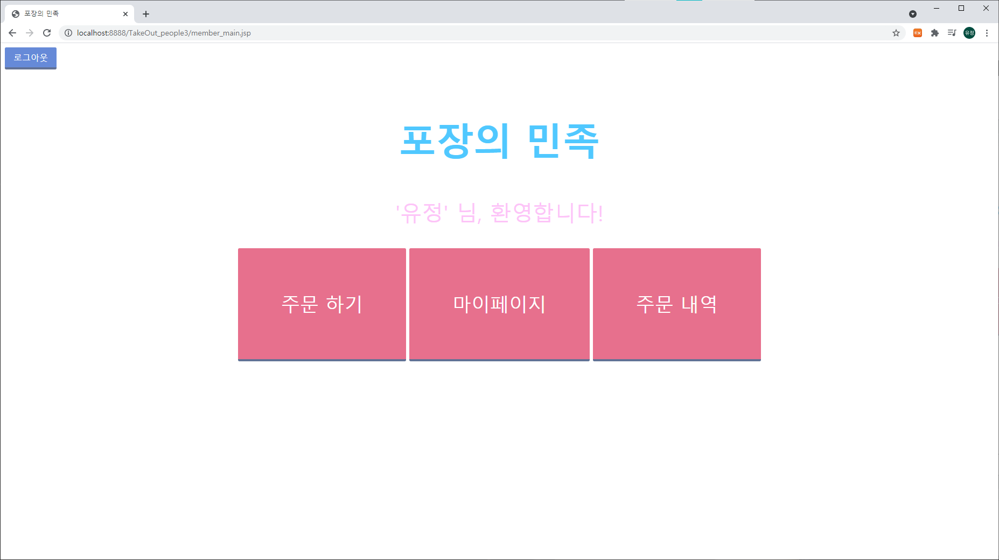
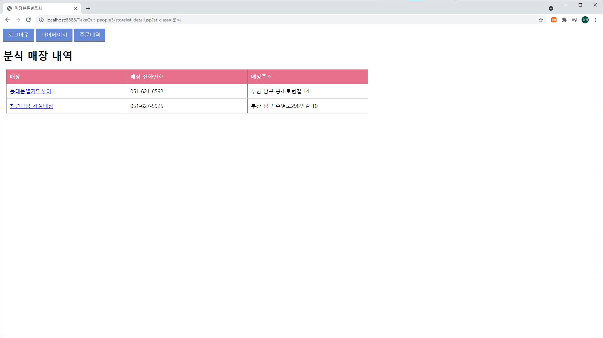
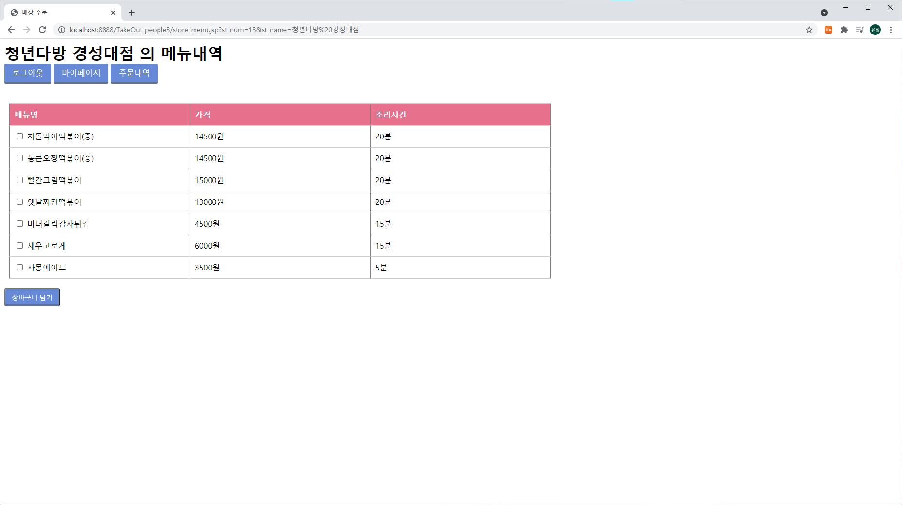
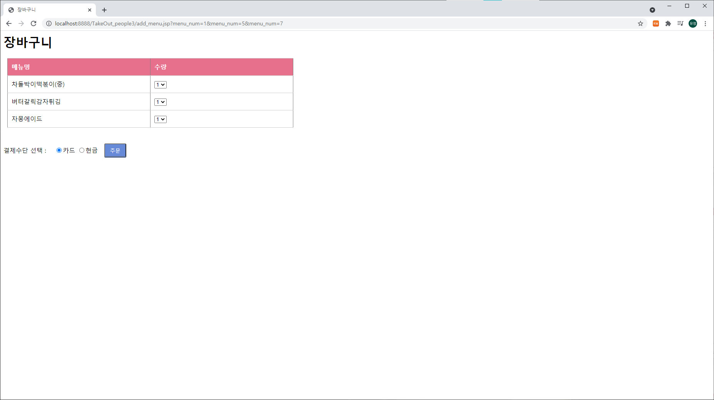
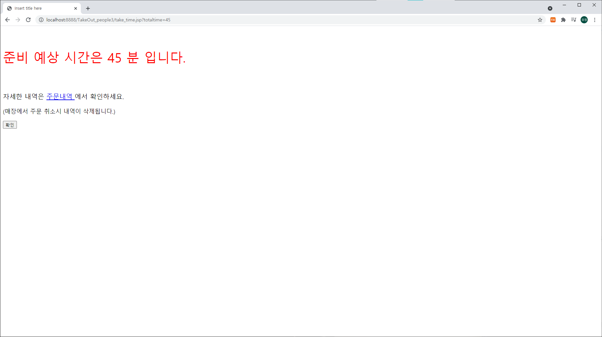
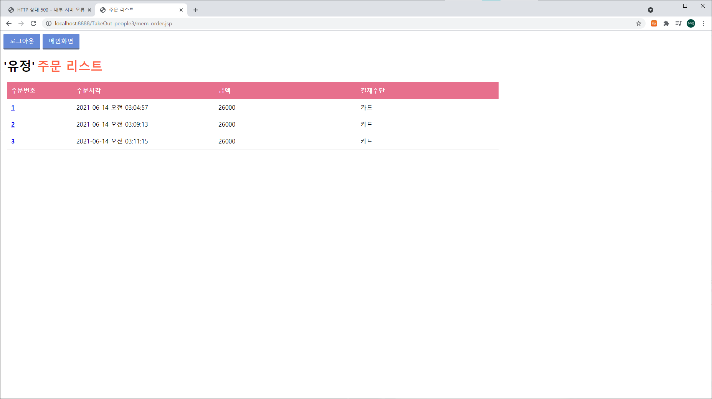
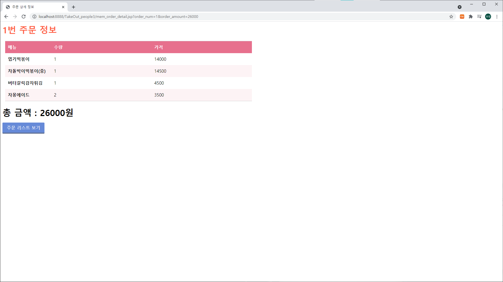
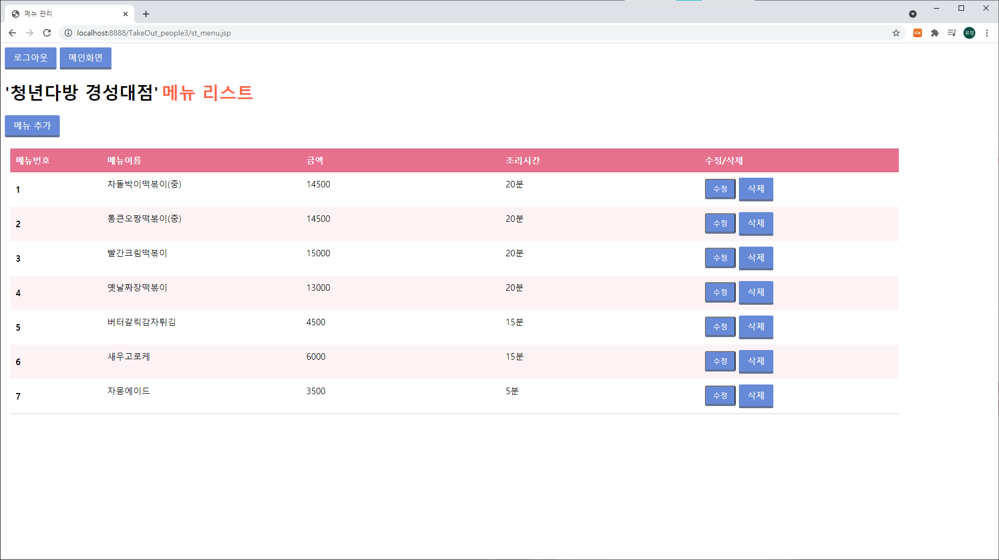
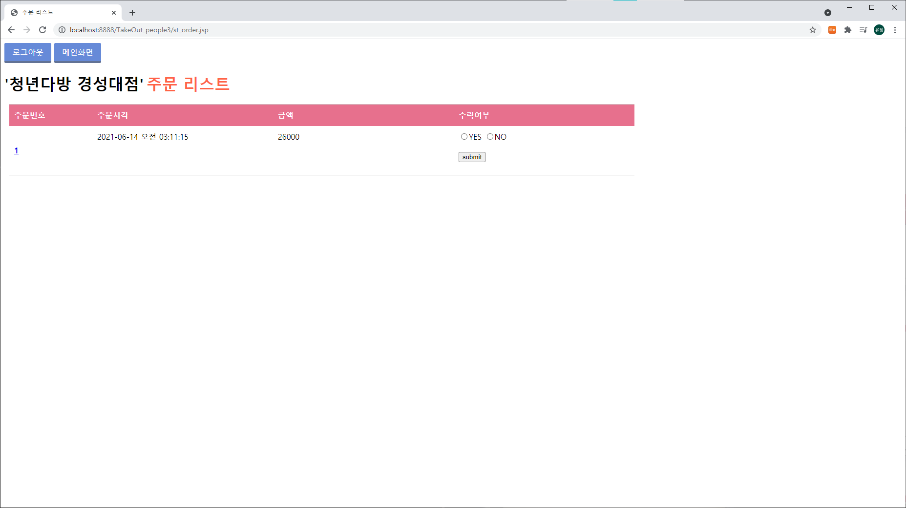

# 포장의 민족
### 🎨 개요

JSP 를 사용한 음식점 포장 주문 웹 서비스

개발 기간 : 2020.06 ~ 2020.06

### 📣 기능

#### 고객

- 카테고리별 음식점 조회
- 주문
- 주문 내역 조회

#### 점주

- 주문 내역 조회
- 매출(연/월/일) 조회
- 메뉴 추가/변경/삭제

  

### 🖥 화면

### [고객 메인]

### [고객 음식점 조회]

  
  
  

### [고객 주문]

  
  

### [고객 주문 내역 조회]

  
  

### [점주 메인]

### [점주 메뉴 추가/변경/삭제]

### [점주 주문 내역 조회]

  
  

