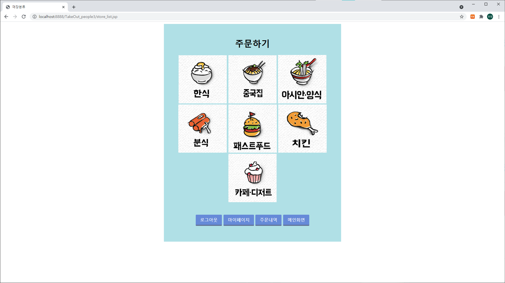
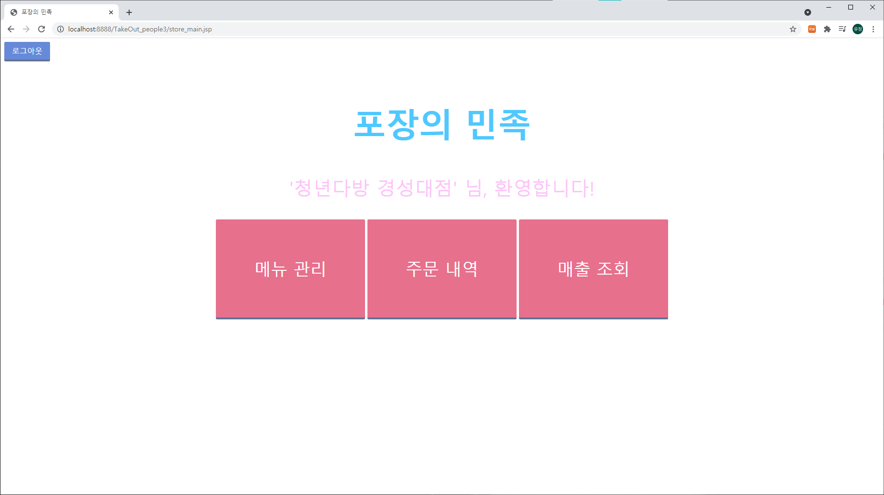
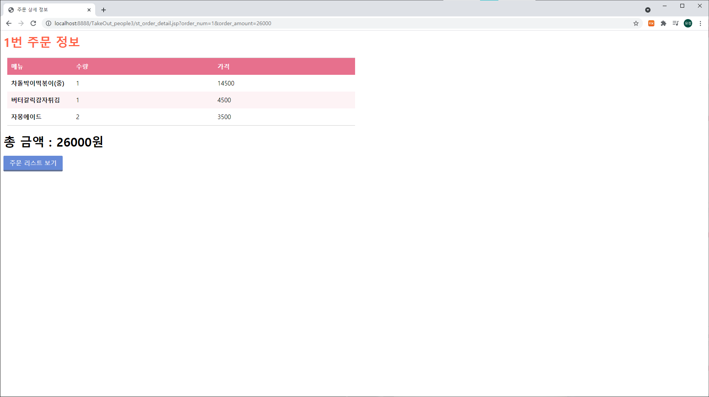

# 포장의 민족
### 🎨개요

JSP 를 사용한 음식점 포장 주문 웹 서비스

개발 기간 : 2020.06 ~ 2020.06

### 📣기능

#### 고객

- 카테고리별 음식점 조회
- 주문
- 주문 내역 조회

#### 점주

- 주문 내역 조회
- 매출(연/월/일) 조회
- 메뉴 추가/변경/삭제

[고객 메인]

[고객 음식점 조회]

[고객 주문]

[고객 주문 내역 조회]

[점주 메인]

[점주 메뉴 추가/변경/삭제]

[점주 주문 내역 조회]

